# 荷兰国旗问题

> 荷兰国旗问题
>
> 给定一个任意的数字数组和一个任意目标值target
>
> 将小于目标值的元素放置在原数组的左侧,大于目标值的元素放置在原数组的右侧，等于目标值的放在中间
>
> (不能创建新数组，只能操作原数组)

### 解决思路

> 定义一个小于区，一个大于区；遍历数组，挨个和目标值比较，
>
> （1）小于target，与小于区的后一个位置交换，当前位置后移；
>
> （2）等于target，当前位置直接后移；
>
> （3）大于target，与大于区的前一个位置交换，当前位置不动（交换到此位置的数还没比较过，所以不动）。

### 思维图解

1、定义了小于target的区域left，初始值为-1，定义了一个大于target的区域right，初始值为arr.length，定义了一个index为当前的位置，初始值为0。

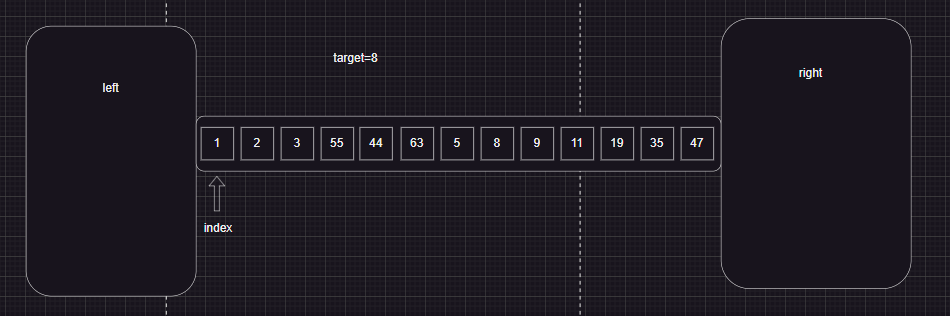

首先数组的第一个元素1和target比较，小于target值，（与小于区后一个位置交换）

我们可以这样做：小于区域位置右移，即left++，再直接让当前位置index和left位置交换，此时index为0，left为0，这一步相对于自己和自己交换，然后当前位置指针后移，index++

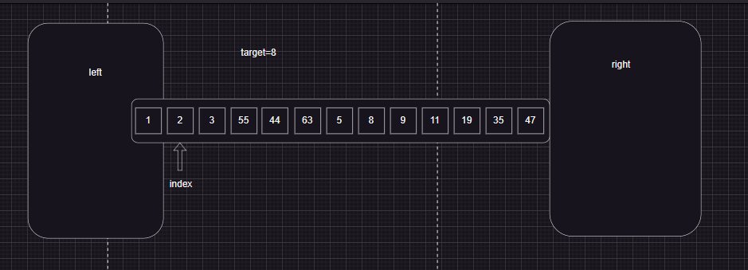

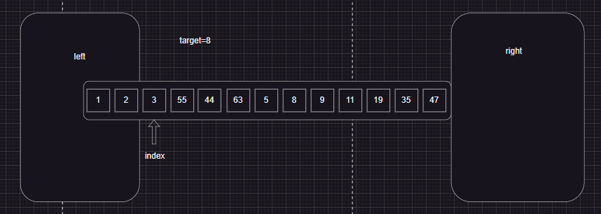

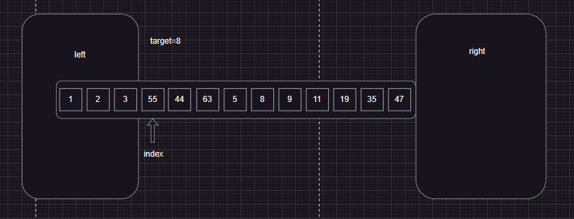

此时到这一步，arr[index]的值比target大，（与大于区的前一个位置交换，当前位置不动（交换到此位置的数还没比较过，所以不动））

我们可以这样做：大于区域位置左移，即right--，再直接让当前位置index和right位置交换，此时right区域就包含了已经比较过的值55，但是index交换过来的值47还没有和target值比较过，所以在这一步index指针不能++

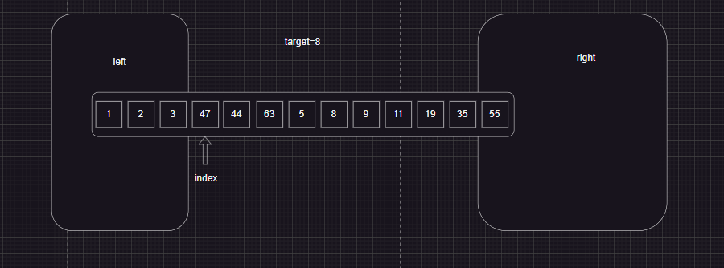

再让47和8比较，47比8大，重复上面操作，right--，交换两个数

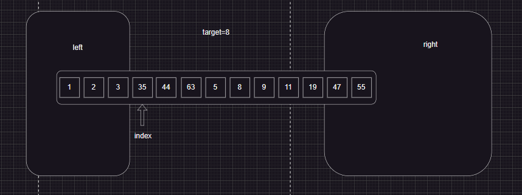

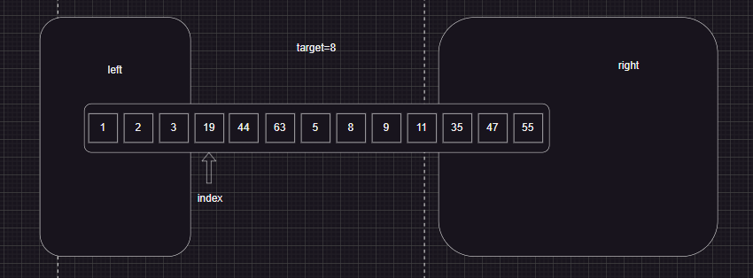

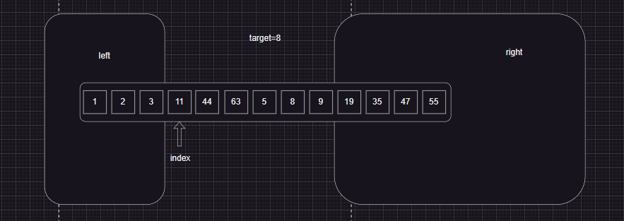

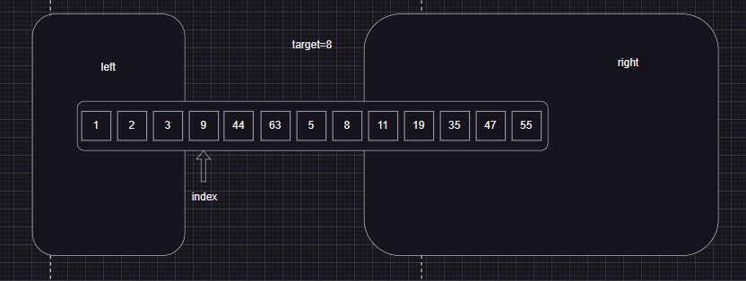

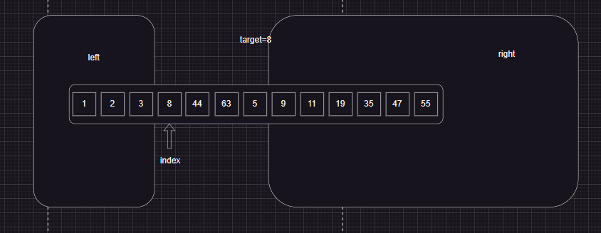

终于换到8了，此时target的值等于arr[index]的值，（当前位置直接后移），直接index++，但left值不变，因为我们是小于target的放left，大于target的放right，至于等于target的，把他挤到中间。

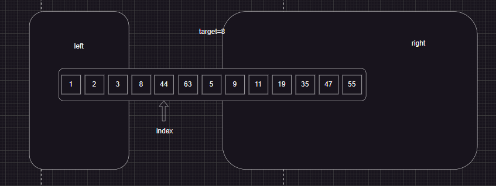

此时arr[index]和target比较，44大于8，那么（right--，交换两个数）

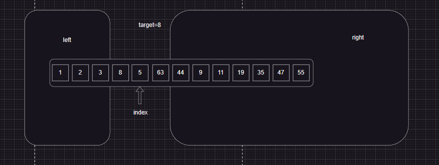

此时到了最难理解的一步，arr[index]和target比较，5小于8，我们看看第一次小于target交换的时候做的操作

> （第一次小于target交换的时候做的操作）--->  我们可以这样做：小于区域位置右移，即left++，再直接让当前位置index和left位置交换，此时index为0，left为0，这一步相对于自己和自己交换，然后当前位置指针后移，index++

这次和那次的操作是一样的：小于区域位置右移，即left++，再直接让当前位置index和left位置交换，这次就不再是自己和自己交换了

小于区域右移(left++)后，8和5交换，然后当前位置指针后移，index++

到了这一步你应该理解了，为什么之前arr[index]小于target时，老是自己和自己交换，因为要考虑到有等于target值的情况，有时left++后，left的值不再和index的值一样了

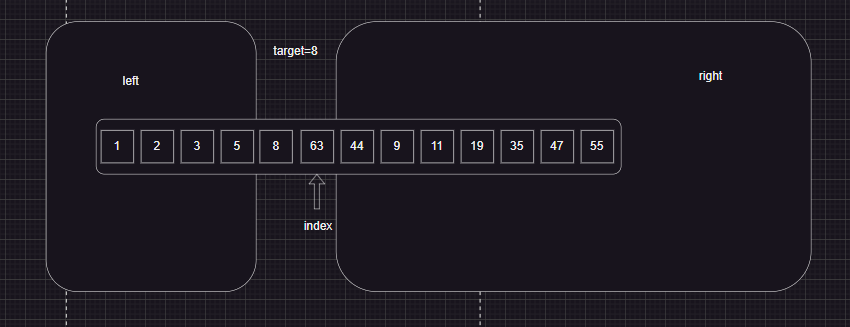

然后arr[index]和target比较，63大于8，那么（right--，交换两个数）

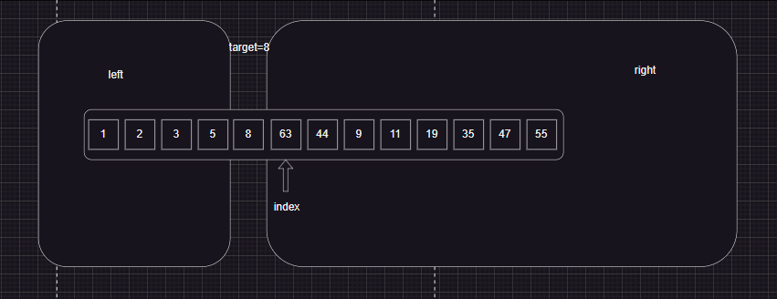

此时，整个数组已经比较完成，将小于目标值的元素放置在原数组的左侧,大于目标值的元素放置在原数组的右侧，等于目标值的放在中间。这里可以看出来，循环的条件是index<right，当index和right区域撞上时，数组也排序完成了

### 详细代码

```js
// 荷兰国旗问题
// 给定一个任意的数字数组和一个任意目标值
// 将小于等于目标值的元素放置在原数组的左侧,将大于目标值的元素放置在原数组的右侧
// (不能创建新数组，只能操作原数组)
function HollandEnsign(arr, target) {
  if (arr === null || arr.length < 2) return
  // 定义数组左侧小于等于target值的区域
  let left = -1
  // 定义数组右侧大于target值的区域
  let right = arr.length
  // 当前位置
  let index = 0
  while (index < right) {
    if (arr[index] < target) {
      left++
      let temp = arr[index]
      arr[index] = arr[left]
      arr[left] = temp
      index++
    } else if (arr[index] > target) {
      right--
      let temp = arr[index]
      arr[index] = arr[right]
      arr[right] = temp
    } else {
      index++
    }
  }
  return console.log('遍历后的数组:',arr);
}
HollandEnsign([1, 2, 3, 55, 44, 63, 5, 8, 9, 11, 19, 35, 47], 8)
```

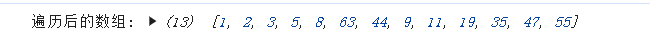