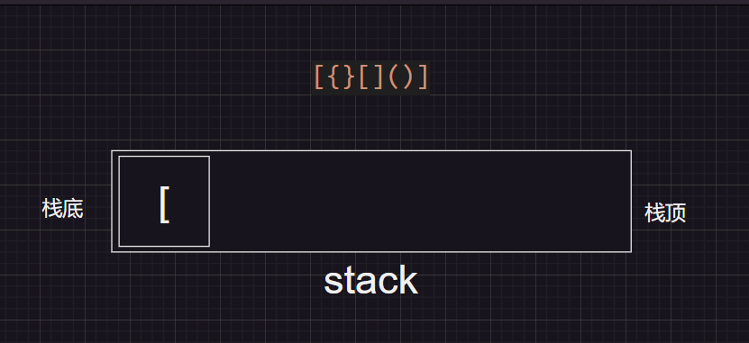
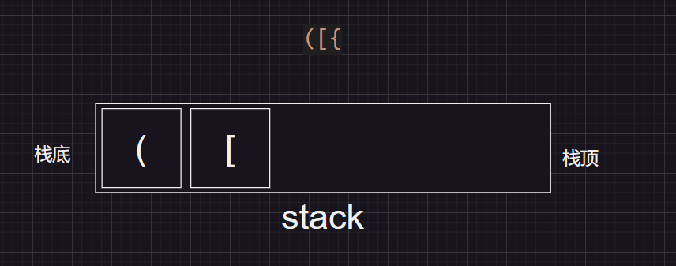

# 有效的括号序列

> 给定一个只包括 `'('`，`')'`，`'{'`，`'}'`，`'['`，`']'` 的字符串 `s` ，判断字符串是否有效。
>
> 有效字符串需满足：
>
> 1. 左括号必须用相同类型的右括号闭合。
> 2. 左括号必须以正确的顺序闭合。
> 3. 每个右括号都有一个对应的相同类型的左括号。

## 示例

> **输入：**s = "()"
>
> **输出：**true

> **输入：**s = "()[]{}"
>
> **输出：**true

> **输入：**s = "(]"
>
> **输出：**false

> **输入：**s = "([])"
>
> **输出：**true

## 解决思路

> 判断括号的有效性可以使用「栈」这一数据结构来解决。
>
> 我们遍历给定的字符串 s。当我们遇到一个左括号时，我们会期望在后续的遍历中，有一个相同类型的右括号将其闭合。由于后遇到的左括号要先闭合，因此我们可以将这个左括号放入栈顶。
>
> 当我们遇到一个右括号时，我们需要将一个相同类型的左括号闭合。此时，我们可以取出栈顶的左括号并判断它们是否是相同类型的括号。如果不是相同的类型，或者栈中并没有左括号，那么字符串 s 无效，返回 False。
>
> 在遍历结束后，如果栈中没有左括号(栈为空)，说明我们将字符串 s 中的所有左括号闭合，返回 True，否则返回 False。
>
> 注意到有效字符串的长度一定为偶数，因此如果字符串的长度为奇数，我们可以直接返回 False，省去后续的遍历判断过程。
>

## 思维图解

### 有效的括号序列：

> [{}[]()]

1、定义了一个用来遍历字符串的栈stack，由于js中没有栈的概念，这里我们遵循后进先出的原则，每次从栈顶入栈，出栈的时候也只能先取出栈顶的元素，依次遍历字符串的每一个元素，遇到左括号的时候就入栈


2、遍历遇到右括号时，就拿这个右括号与栈顶的元素比较，如匹配就将栈顶元素弹出，不匹配代表不是有效的括号序列





3、遍历结束，栈为空，判断这是一个有效的括号序列


### 无效的括号序列(1)：

> [{]}


与栈顶元素比较，不匹配代表不是有效的括号序列


### 无效的括号序列(2)：

> （[{




遍历结束，栈不为空，判断这不是一个有效的括号序列


## 详细代码

### 方法1

```js
/**
 * @param {string}
 * @return {boolean}
*/
function isValid(s) {
  // 如果字符串的长度为奇数,我们可以直接返回 False,省去后续的遍历判断过程
  if (s.length % 2 !== 0) return false
  let stack = []
  for (let i = 0; i < s.length; i++) {
    // 如果是左括号，就入栈与之对应的右括号
    switch (s[i]) {
      case '(':
        stack.push(')')
        break
      case '[':
        stack.push(']')
        break
      case '{':
        stack.push('}')
        break
      // 如果不是左括号就看看是不是与栈顶(前面入栈的右括号)元素相等,相等就弹出栈顶元素
      case stack[stack.length - 1]:
        stack.pop()
        break
      // 不相等代表不匹配，直接返回false
      default:
        return false
    }
  }
  // 遍历结束检测栈的长度，等于0代表栈空返回true,代表是有效的括号序列
  return stack.length === 0
};
console.log(isValid('[{}[]()]'));//true
console.log(isValid('[{]}'));//false
console.log(isValid('[]{}'));//true
console.log(isValid('[]'));//true

```

### 方法2

```js
/**
 * @param {string}
 * @return {boolean}
*/
function isValid(braces) {
  const stack = []
  try {
    let temp = braces.split('')
    for (let i = 0; i < temp.length; i++) {
      let item = temp[i]
      if (item === '(' || item === '{' || item === '[') {
        // 如果是左括号，就入栈
        stack.push(item)
      } else {
        // 如果是右括号,就删除栈顶元素,看看删除的那个是不是与之对应的左括号，如果不是就throw弹出异常到catch去返回false
        if (item === ')' && stack.pop() !== '(') throw ''
        if (item === ']' && stack.pop() !== '[') throw ''
        if (item === '}' && stack.pop() !== '{') throw ''
      }
    }
  } catch {
    return false
  }
  // 遍历结束检测栈的长度，等于0代表栈空返回true,代表是有效的括号序列
  return stack.length === 0
}
console.log(isValid('[{}[]()]'));//true
console.log(isValid('[{]}'));//false
console.log(isValid('[]{}'));//true
console.log(isValid('[]'));//true
```

### 方法3

由于js中没有栈的概念，我们这里创建一个工厂函数，用来生成模拟一个栈的数据结构，并用立即执行函数将创建栈的函数添加到window对象的方法中

```js
// 栈 Stack
// 栈 LIFO （last in first out） 后进先出
// push(element(s)): 添加一个(或几个)新元素到栈顶。
// pop(): 移除栈顶的元素，同时返回被移除的元素。
// peek(): 返回栈顶的元素, 不对栈做任何修改(该方法不会移除栈顶的元素, 仅仅返回它
// isEmpty(): 如果栈里没有任何元素就返回 true，否则返回 false。
// clear(): 移除栈里的所有元素。
// size(): 返回栈里的元素个数。该方法和数组的 length 属性很类似。
(function (window) {
  let prototype = {
    push: function (value) {
      this.items[this.count] = value
      this.count++
    },
    pop: function () {
      let item = this.items[this.count - 1]
      delete this.items[this.count - 1]
      this.count--
      return item
    },
    peek: function () {
      return this.items[this.count - 1]
    },
    isEmpty: function () {
      return this.count === 0
    },
    clear: function () {
      this.items = {}
      this.count = 0
    },
    size: function () {
      return this.count
    },
  }
  function createStack() {
    let stack = {
      count: 0,
      items: {},
    }
    stack.__proto__ = prototype
    return stack
  }
  window.createStack = createStack
})(window)

let s1 = createStack()
s1.push(11)
s1.push(22)
s1.push(33)
s1.push(44)
s1.push(55)
console.log(s1);


// 有效的括号序列
let bracket1 = '{}()[]'
let bracket2 = '{(})[]'
let bracket3 = '{}())'
function isValidBracket(bracket) {
  // 传入的不是一个字符串就报错
  if (typeof bracket !== "string") throw new Error('bracket must be string')
  // // 如果字符串的长度为奇数,直接返回 False,省去后续的遍历判断过程
  if (bracket.length % 2 !== 0) return false
  // 创建一个栈
  let stack = createStack()
  for (let i = 0; i < bracket.length; i++) {
    switch (bracket[i]) {
      // 是左括号就入栈
      case '(':
        stack.push(')')
        break;
      case '{':
        stack.push('}')
        break;
      case '[':
        stack.push(']')
        break;
      // 如果不是左括号就看看是不是与栈顶(前面入栈的右括号)元素相等,相等就弹出栈顶元素
      case stack.peek():
        stack.pop()
        break;
      // 不相等代表不匹配，直接返回false
      default:
        return false
    }
  }
  // 遍历结束检测栈的长度，等于0代表栈空返回true,代表是有效的括号序列
  return stack.count === 0
}
console.log(isValidBracket(bracket1));//true
console.log(isValidBracket(bracket2));//false
console.log(isValidBracket(bracket3));//false
console.log(isValidBracket('([}}])'));//false


// 栈的其他用法
// 10进制转二进制
/*
  10/2=5 ...0
  5/2=2  ...1
  2/2=1  ...0
  1/2=0  ...1
*/
// 后进先出---> 1010
function toBinary(decimalNumber) {
  let stack = createStack()
  let binaryString = ''
  while (decimalNumber > 0) {
    let rest = decimalNumber % 2
    stack.push(rest)
    decimalNumber = Math.floor(decimalNumber / 2)
  }
  while (!stack.isEmpty()) {
    binaryString += stack.pop()
  }
  return binaryString
}
console.log(toBinary(10));
```


